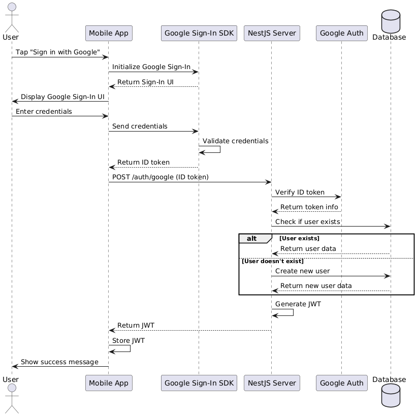

### A simple authentication and authorization demo with NestJs and React Native

#### Backend

1. Triển khai xác thực người dừng dựa trên email, mật khẩu ([refer](pass-auth.md))
2. Hoàn thành bước 1, tiếp tục thêm tính năng xác thực bằng Google ([refer](google-auth.md))
3. Thêm tính năng phân quyền người dùng dựa trên vai trò (Role based access control) ([refer](role-based.md))

#### Mobile

Tech-stack: React-native, Expo, Axios, ReactQuery,...

1. Triển khai xác thực bằng google ([refer](https://react-native-google-signin.github.io/docs/original))

- Lưu ý: khi cấu hình, cả server và frontend phải cấu hình chung Google Client ID thuộc loại web app
